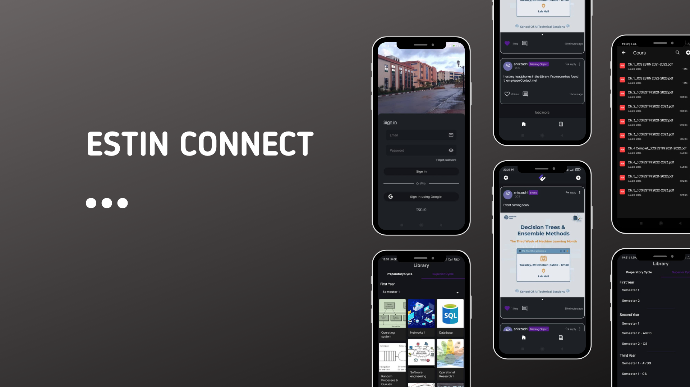

# EstinConnect

UniConnect is a social media platform designed exclusively for students of Estin. It aims to create a digital community where students can connect, share updates, and access essential academic resources. This app brings students together and provides them with a central hub for news, social interaction, and a comprehensive resource library.

---

## Features

### 1. **Student Feed**
   - **Create Posts:** Share photos, text updates, or links.
   - **Like & Comment:** Engage with other students' posts.
   - **Follow Topics & Clubs:** Subscribe to specific channel.
   - **Notifications:** Stay informed about new posts, comments, and updates from followed topics and users.
   - **Tagging:** Tag posts with specific subjects for better user experience.

### 2. **Library Resources**
   - **Digital Library Access:** Search and download resources such as study materials.
   - **Categorized Sections:** Quickly browse materials organized by subject, course, or semester.
   - **User Uploads:** Allow students to share notes and materials, building a collaborative knowledge base.

### 5. **Events & Announcements**
   - **University Events:** Keep up with academic events, club meetings, and student-led activities.
   - **Push Notifications:** Never miss out on important announcements or deadlines.

### 7. **Privacy & Security**
   - **University-Only Access:** Restrict registration to students with valid university email addresses.
   - **Report/Block Users:** Keep the community safe and respectful.
   - **Data Privacy:** All user data is securely stored and protected.

---

## Usage

### Registration & Authentication
Students must register using their university email to access the app. The app will verify their status as current students to maintain a secure, student-only environment.

### Adding & Interacting with Posts
- **Create a Post**: Add text, images, or links to your posts.
- **Engage**: Like, comment, and share other students' posts.
- **Targeted posts**: Only see posts meant for you.

### Accessing the Library
- **Browse Resources**: Find categorized materials such as study guides, past exams, and lecture notes.
- **Upload Notes**: Contribute to the library by uploading personal notes or resources.
- **Downloading**: Save important resources to your device for offline access.

---

## License

This project is licensed under the MIT License. See the [LICENSE](LICENSE) file for details.

---

## Contact

For any inquiries, reach out to Anis Zadri at anis.zadri8@gmail.com.
